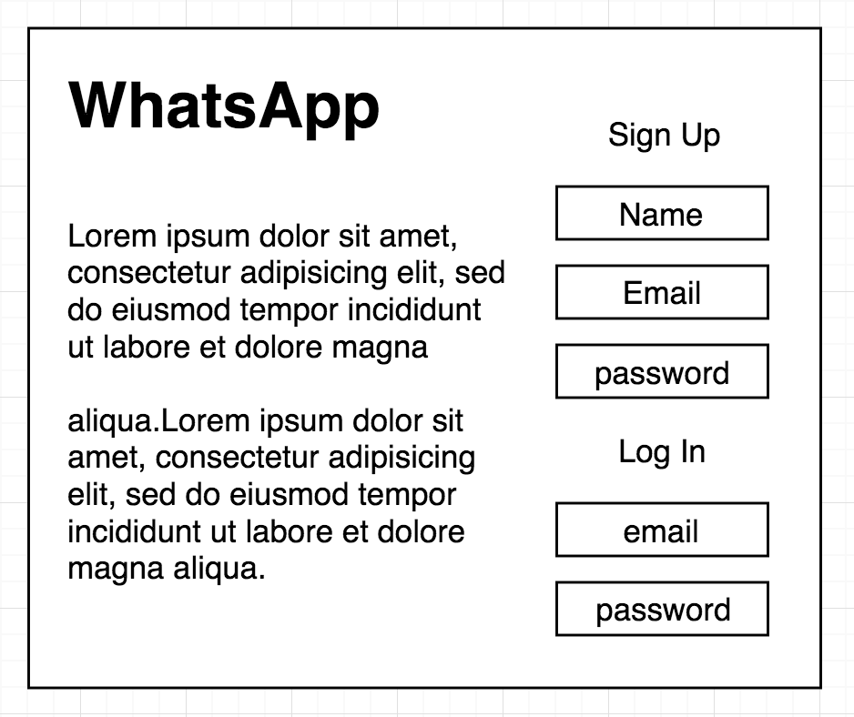
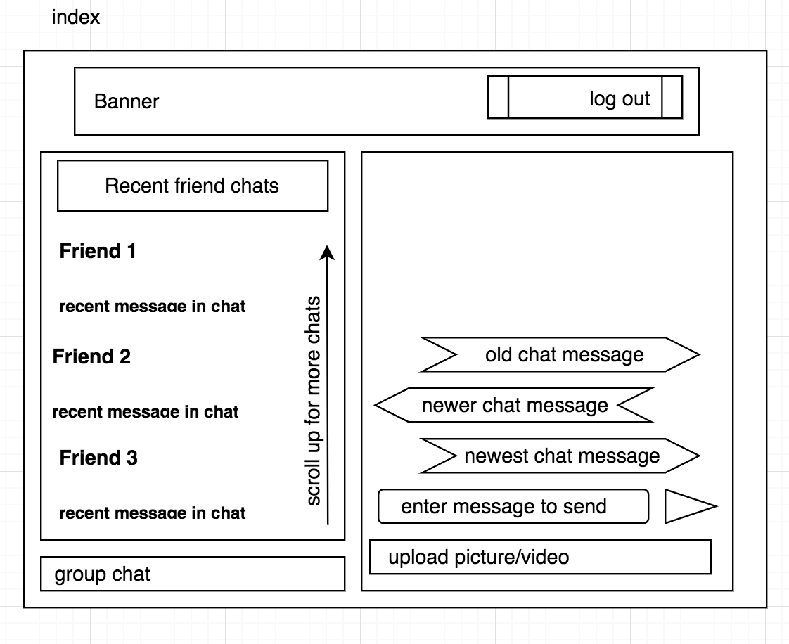

# WhatsApp
##### Hugo Sykes, Malachy Gilchrist

## Introduction

This web app is a mimic of WhatsApp online, written entirely in React. Users can Register and send messages to one another or be part of group conversations.

## User Stories

```
As a conversational virtuoso
So that I can one up all my friends
I can exchange messages with my friends

As a party thrower
So that I can plan events
I can exchange messages with friends in a group chat

As a person of privacy
So that my account is secure
I register with a password

As a happy snapper
So that i can share my pictures
I can upload pictures to a chat
```

## Page Layouts



